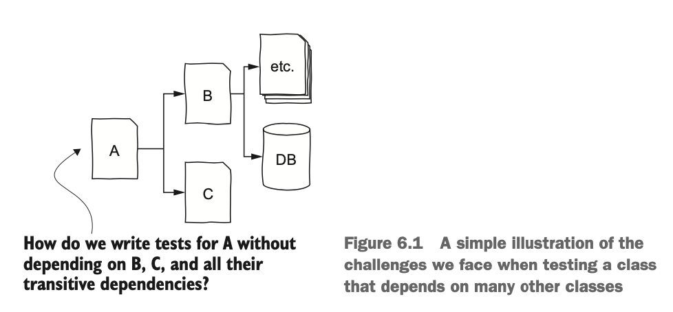

# 7 Designing for testability

Sources:

Chapters from _[Effective Software Testing](https://www.manning.com/books/effective-software-testing)_ (Aniche):

- Chapter 6 Test doubles and mocks
- Chapter 7 Designing for testability

## Outline

- unit testing — what is a "unit"? Why do test units in isolation?
- sometimes modules depend on each other, and we want to test units in isolation without testing their dependencies in isolation



<small>Figure reproduced from Chapter 6.</small>

In the above example, if want to test the `A` module, would also need instances of modules `B` and `C`, which would require their dependencies to initialised, and so on. This is a lot of work to just test the module we wanted to test in the first place!

## Testing and dependency injection 

A common strategy is to create _fake_ `B` and `C` objects and inject them into `A` for the purpose of a given test. The fake `B` and `C` modules are given "hard-coded" behaviour. We're pretending that they work as expected _in the context of a particular test case_, so we can focus our assertions on the behaviour of module `A`.

Some advantages of this are:

* **Control**. There's no need for complicated setup steps to induce specific behaviours that need to be tested. We can directly tell the fake objects what they should do.
* **Speed**. For classes that interact with external resources (web server, databases, files), it's much faster to instead interact with a fake in-memory replica of the real thing.
* **Design**. This style of testing causes us to be reflective about our design and the interdependencies among our classes. All of this is only possible if you allow clients to _inject_ dependencies when initialising modules. For example, what if module `A` was responsible for initialising modules `B` and `C` itself?

```java
public class A() {
  private B b;
  private C c;

  public A() {
    this.b = new B();
    this.c = new C();
  }
}
```

In the code above, all instantiations of `A` would require "full" or "real" instantiations of `B` and `C` objects. But if we were to use _dependency injection_:

```java
public class A() {
  private B b; // Use an abstract type 
  private C c; // Use an abstract type

  public A(B b, C, c) {
    this.b = b;
    this.c = c;
  }
}
```

Now in our tests, we can initialise our `A` object like this:

`new A(new FakeB(), new FakeC())`


**There are a few different ways to inject simpler "doubles" for testing.**

**Fake objects** have working, but much simpler, implementations of the classes they simulate. For example, a fake database might provide the same functionality as the real thing, but use an `ArrayList` instead of a full MySQL database. Developers in real-life often use simpler databases for testing. For example, Java developers like to HyperSQL database (HSQLDB), an in-memory database, for testing.

**Stubs and mocks** provide hard-coded answers to all method calls performed during a test. For example, suppose you call `getAllInvoices` in an invoice tracking application. The method will return a hard-coded list of invoices, used only for testing. This is a common strategy, because often all you need from a dependency is for it to return a value that your system-under-test will use. Some mocking libraries also let you do checks like verifying that a method was only called once, or that methods were never called with particular arguments.

_[Mockito](https://site.mockito.org/)_ is a popular mocking and stubbing library for Java.

## Example

The author of _Effective Software Testing_, Maurício Aniche, has kindly made [all his code examples available on GitHub](https://github.com/effective-software-testing/code/tree/main). We'll look at a quick example of using Mockito to stub out a dependency. Specifically, we are looking at the following:

* [Code](https://github.com/effective-software-testing/code/tree/main/ch6/src/main/java/ch6/stub)
* Tests
  * [Without mocks](https://github.com/effective-software-testing/code/blob/main/ch6/src/test/java/ch6/stub/InvoiceFilterWithDatabaseTest.java)
  * [With mocks](https://github.com/effective-software-testing/code/blob/main/ch6/src/test/java/ch6/stub/InvoiceFilterTest.java)

### Key things to look at in the source code 

* First, take a second to peruse the code. We've got a number of interacting classes:
  * `DatabaseConnection`
  * `Invoice`
  * `InvoiceFilter` (`InvoiceFilterWithDatabase` is provided as a "bad" example, where it requires the database to be initialised)
  * `IssuedInvoices`

If we wanted to test the `InvoiceFilter` class, we would need to initialise a `DatabaseConnection` object and use that to initialise an `IssuedInvoices` object. You see that in the [`InvoiceFilterWithDatabaseTest.java`](https://github.com/effective-software-testing/code/blob/main/ch6/src/test/java/ch6/stub/InvoiceFilterWithDatabaseTest.java) file. Before each test case, a new database connection must be established (and reset so that each test gets a fresh DB).

Now imagine a larger class with a more complex (i.e., more realistic) database schema. And recall our discussion about systematically choosing a thorough ("requirements covering") set of test inputs. Our tests would get untenably complicated to setup, and untenably slow to run. All because we have to initialise and setup a dependency (`DatabaseConnection`) that's not the focus of our testing in the first place!

**Using a stub object**. Now take a look at [`InvoiceFilter`](https://github.com/effective-software-testing/code/blob/main/ch6/src/main/java/ch6/stub/InvoiceFilter.java). The constructor takes a parameter `IssuedInvoices`, which it uses to initialise the dependency in the class. Now, a client using the class has to _inject_ an `IssuedInvoices` object into the `InvoiceFilter` class. In this case, the "client" that's using the module is our tests. As a result of this change, the `InvoiceFilter` has no need for a `DatabaseConnection` dependency, and we can simplify away large swathes of that behaviour.

Take a look at [`InvoiceFilterTest`](https://github.com/effective-software-testing/code/blob/main/ch6/src/test/java/ch6/stub/InvoiceFilterTest.java). The amount of code you're writing is more or less the same, but without the slow DB connection and without persisting information to a database that needs to be cleared between test runs. Also, crucially, the stubbing away of the database connection means that bugs there wouldn't affect these tests. We are implicitly assuming here that the database connection has been tested in isolation as well.

## To mock or not to mock 

Mocking makes your tests less realistic. Your tests are relying some imaginary object that will never exist in real usage of your system. The lack of coupling between modules that you are afforded by your mock objects can actually lead you astray.

For example, suppose you have modules `A` and `B`. In the tests for `A`, you have mocked the behaviour of `B`. In some future change, the postconditions assured by `B` change due to changes in your requirements. Typically, when you make changes to `B`, you would also update tests for `B`. But it would be easy to forget to check if `A` handles these changes well. Your tests for `A` would pass with no problems, because were relying on an "assumed good" version of `B` that is now out of date.

Like all tools, there are specific good times to use mocking:

* **Slow dependencies**. Databases, web services, etc.
* **External infrastructure**. Regardless of speed, it may be too complicated to setup and tear down connections to external infrastructure.
* **Cases that are hard to simulate.** A common case is when you want the dependency to throw an exception. If you've written your code defensively enough, it can be difficult to come up with scenarios that would cause a module to crash with an exception. Mocks can help you force these exceptions and test that your code handles the exceptions gracefully.

You should NOT mock types that you don't have control over (e.g., from external libraries). If that library ever changes, your tests would happily continue passing, because they rely on an idealised version of it.

## Designing for testability

Many rules about software design in general also apply to designing for testability. So I won't repeat them in too much detail.

We talk about "designing for testability" (i.e., designing so that testing is easier), but we can also think about things in the opposite direction. If testing difficulties arise like the ones below, that is often good feedback for you about your software's design.

* **Non-cohesive classes can lead to giant test suites**. Naturally, since the class is covering many responsibilities. If you find yourself frequently coming back to the same test suite to add more tests for new functionality, that may be a hint that the class (and its tests) and handling too many responsibilities. It may be time to break it up.
* **Tightly coupled classes result in tests that are difficult to set up.** In some ways, excessive use of mocking libraries like Mockito are a symptom of classes that are coupled with so many dependencies that it becomes difficult to test things in isolation. Decoupling individual pieces of logic result in testable isolated modules—and then perhaps you use mocking where this removal is not possible or feasible. (I.e., at some point, some class will have connect to a database. Isolate that requirement.)
* **Complex conditions**. With large compound conditions, we have already seen that the space of possible inputs can easily blow up, especially if we're trying to satisfy adequacy criteria like branch coverage. You can refactor your code to remove or combine conditions.
* **Private methods.** In general private methods should be tested through the public methods they support. If it does something too complex or separate from the public methods that use it (e.g., it's a utility that many methods are using), that's a good sign that the method does not belong in its current place. It may be time to refactor it into a separate class, where it can be public and testable.
* **Observability**. You need to be able to observe an object's state in order to test it. Does this mean you need to provide getters for _all_ fields in the object? Not necessarily. Just like with private methods, you can often "test" private fields through other means—for example, through public functions that internally use those fields. For example, the `String` class has a number of private fields that are not exposed in any way (e.g., a boolean flag indicating whether the string uses UTF-8 encoding or not; or a uuid for serialisation).
